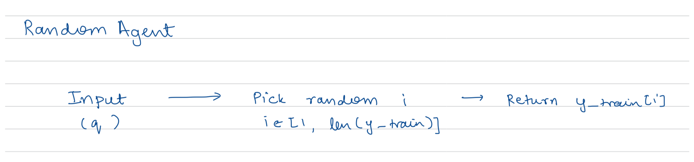
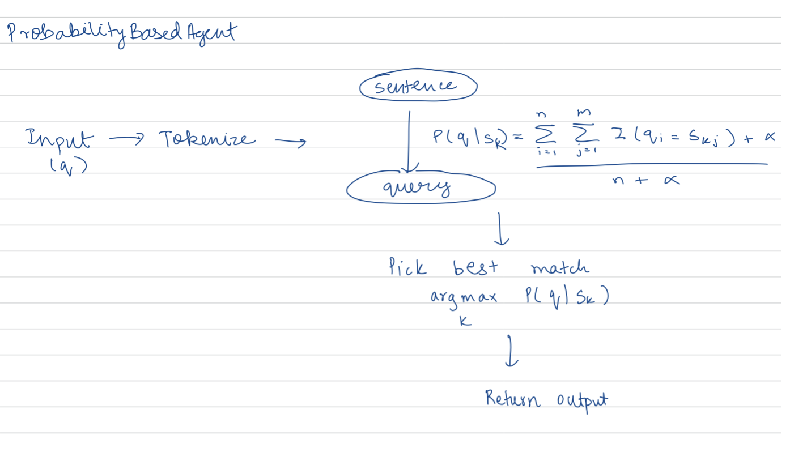
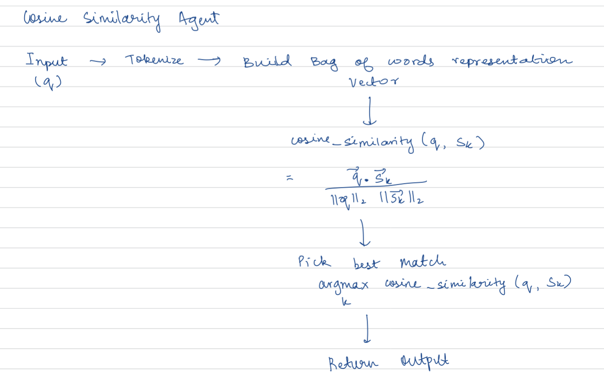
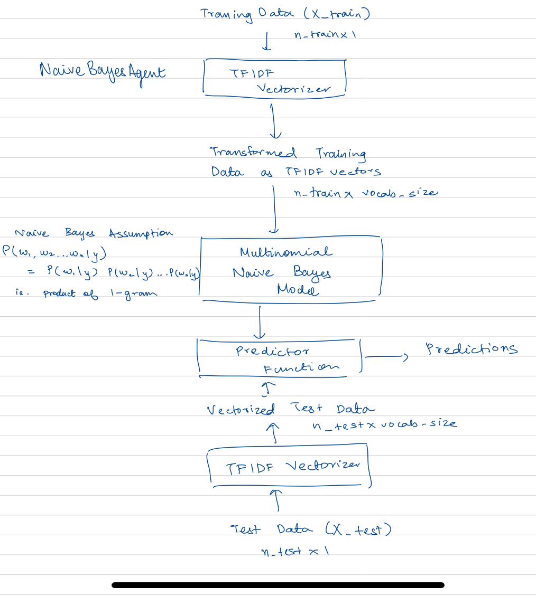

# AI Medical Chatbot

# PEAS/Agent Analysis

## Explain what your AI agent does in terms of PEAS. What is the "world" like? 
The AI physician chatbot functions within a simulated "world" of virtual health websites and websites on which it delivers treatment to patients through chat interfaces. In relation to the PEAS framework:
	Performance Measures: Overlap of model generated response with actual response, BLEU/ROUGE scores for response quality, and user satisfaction ratings.
	Environment: Virtual conversational AI environment found on health websites, where interactions are limited to text communication.
	Actuators: The chatbot applies rule-based systems and probabilistic models, supplemented by some NLP techniques as needed, to generate answers that are delivered through web APIs or interfaces.
	Sensors: It receives user input by typing and gathers instantaneous feedback to adapt and enhance responses in real-time.
 
## What kind of agent is it? Goal based? Utility based? etc. 
The chatbot is a goal-based agent, as it has a precise objective: to answer patient queries correctly, emulating a doctor's line of reasoning. This system understands symptoms, processes contextual information, and produces medically relevant answers. Making use of pattern matching, probabilistic models, and some NLP techniques, it reaches an informed decision and continually refines accuracy based on feedback.

## Describe how your agent is set up and where it fits in probabilistic modeling
The agent starts with a strong foundation in simple probabilistic models such as pattern matching and cosine similarity to address straightforward interpretation of user queries. These models form a foundation for learning how to process and answer medical queries. As the complexity of the queries increases, the system uses more sophisticated NLP techniques to increase interpretation and response accuracy. This probabilistic approach allows the agent to handle natural language processing uncertainties adequately by statistical inference in forecasting and generating appropriate responses based on acquired data over the course of training and from user interactions.

# Data Exploration and Preprocessing

## Data Exploration ([link](https://github.com/Arnav710/cse150a/blob/main/data_exploration.ipynb))
The initial step in our AI healthcare chatbot project is the appropriate exploration of the dataset, and this has a significant contribution towards understanding the shape and dynamics of the medical dialogue we are dealing with. Here, we consider the nature of the dataset and highlight the distribution of word count over descriptions, patient questions, and doctor answers.

Our dataset consists of a total of 256,916 records, each of which has three columns: Description, Patient, and Doctor. This organized format enables us to efficiently analyze and preprocess the text data for training our models.

`Description`: describes the nature of the problem associated with the patients query in the record
`Patient`: The patient describing the problems they are facing
`Doctor`: The doctor's answer to the patient's query

#### Description Length Distribution
The descriptions in our dataset are normally short text, predominantly ranging from 10 to 20 words. This is crucial as it provides a unique, concise context for each patient's question without overwhelming the model.


#### Patient Question Length Distribution
Patient question distributions are more varied, with response lengths usually between 50 and 100 words. This degree of detail is optimal for providing sufficient context and information to allow the AI to generate accurate responses without unnecessary verbosity.


#### Doctor Answer Distribution
The responses of the doctor are longer compared to the questions and descriptions, and most of them are between 50 and 150 words. This range indicates that doctors provide lengthy but brief answers, which is an important aspect for our chatbot to emulate so that it is effective and understandable in communication.


#### Patient and Doctor Answer Distribution Comparison
The histogram displays the distribution of word counts in patient questions and doctor responses. Patient questions tend to be shorter, with a high frequency of lower word counts, while doctor responses generally have a broader distribution with longer texts. The overlap suggests that while some patient questions are longer, doctor responses are generally more detailed on average.


#### Common Patient Words
This plot represents the top 20 most common medically relevant words used in patient questions to doctors. The most frequently mentioned terms include "pain," "doctor," and "blood," suggesting that patients often seek advice about symptoms, medical professionals, and bodily functions. Other used words like "heart," "fever," "infection," and "cancer" indicate common concerns related to specific conditions and treatments. The distribution highlights the primary medical topics patients inquire about, providing insight into prevalent health concerns.


An understanding of word count proportion and common symptoms in the database informs our preprocessing strategies and helps us calibrate the AI model to overcome common dialogue styles used in doctor visits. Analysis assures that our chatbot is optimized to understand and answer questions satisfactorily, striking a balance between being too detailed or short in its dialogue.

## Data Preprocessing ([link](https://github.com/Arnav710/cse150a/blob/main/data_preprocessing.ipynb))

Since all three columns in our dataset involved text data, text related preprocessing
had to be done. The data preprocessing pipeline consisted of the following steps:
- Renaming columns
- Normalizing text to lowercase
- Removing non-alphanumeric characters from the text
- Removing stopwords
- Applying stemming to retain the root words

##### Normalizing text to lowercase
This helps limiting the vocabulary size and thus reducing the dimensionality/length
of the feature vectors when converting text to vector representations. Further, 
this preserves the semantic meaning since being upper case does not change the meaning
of the word

#### Removing non-alphanumeric characters from the text
Symbols do not carry too much semantic meaning. Getting rid of them can reduce the
noise in the data.

#### Removing stopwords
Stopwords help establish the flow of the sentence but do not add too much meaning
to it. They appear very commonly and some examples include "the", "and", "to", "in", "by".
Removing these words helps us focus on the most important aspect of the sentence.

#### Stemming
Stemming allows us to retain only the root words by removing any prefixes or suffixes
that may be associated with the word. This helps limit the size of the vocabulary by
sort of grouping different forms of the same words.

The data looks like the following before preprocessing:


The data looks like the following after preprocessing:


# Agent Setup and Training ([link](https://github.com/Arnav710/cse150a/blob/main/models.ipynb))

Before training the model, we split our dataset into train and test components.

After performing the split, their sizes were as follows:
```
Number of samples in train set: 208097
Number of samples in validation set: 23122
Number of samples in test set: 25691
```
Due to limited compute resources we used a subsample of this.

The following descibes the models we built and we later evaluate their performance

#### `RandomAgent`

##### Setup
We built an agent to just give a random response to a user query so that we can use that as a baseline/benchmark
against which we can comapre our other agents.

##### Training/Code

```python
response_lst = list(y_train)
for x in X_test['description'][:sample]:
    random_answer = random.choice(response_lst)
    preds.append(random_answer)
```

##### Diagram



#### `ProbabilityBasedAgent`

##### Setup
The probability based agent constructs the vocabulary by looking at all the  questions in the dataset. 

The probability based model computes the probability of the query vector given each of the patient questions in the dataset. In this way it helps us determine the question in the dataset that is the closest match to the query. The query is tokenized by splitting it at whitespace. Then, we count the number of words that are in common between the query and the i-th sentence. Following that, the number of matches is divided by the length of the query vector. In order to prevent non-zero values, a smoothening factor is added to perform Laplace Smoothening.

   $$P(\text{q | s}) = \frac{\sum_{i=1}^n \sum_{j=1}^m I(q_i = s_j) + \alpha}{n + \alpha}$$

Here, i iterates over the query vector q and j iterates over a sentence s.

It then tries to maximize this probability and outputs the corresponding response.

##### Training Code
```python
class ProbabilityBasedAgent:
    
	def __init__(self, questions, responses):
		self.questions = questions
		self.responses = responses
		self.question_sets = []
		self.vocab = None

	def get_vocab(self):
		vocab = set()
		for question in self.questions:
			for word in question.split():
				vocab.add(word)
		return list(vocab)

	def prob_query_given_sentence(self, query, sentence_lst, alpha=1):
		query_lst = query.split()
		match = 0
		
		for token in query_lst:
			if token in sentence_lst:
				match += 1
		
		# Apply Laplace smoothing
		numerator = match + alpha
		denominator = len(query_lst) + alpha
		
		p = numerator / denominator
		return p

	def train(self):
		self.vocab = self.get_vocab()

		for question in self.questions:
			self.question_sets.append(set(question.split()))

	def find_closest_answer(self, query, k):
		
		probabilities_match = []
		for i in range(len(self.questions)):
			prob = self.prob_query_given_sentence(query, self.question_sets[i])
			probabilities_match.append((prob, self.questions[i], self.responses[i]))

		probabilities_match.sort(reverse=True)

		return probabilities_match[:k]
```

##### Diagram


#### `SimilarityBasedAgent`

##### Setup

The similarity based agent constructs the vocabulary by looking at all the  questions in the dataset. It then converts the sentence into vectors using a using the Bag of Words approach. When it is given a user query, iterates over all records and tries to compute
the cosine similarity between th user query vector and the vector associated with each of the questions in the dataset. It then tries to maximize this similarity.

Machine learning models can not understand the meaning of words directly and work on them. So, the words and sentences in the dataset must be converted to some form of numerical representation. The most common way to do this is to convert sentences into vectors of floating point numbers that lie in n-dimensional space (where n is dependent on the method we use to come up with feature vector embeddings). One of the most simple yet effective ways to do this is the Bag Of Word approach. Here, we get the vocabulary. The vector has a length equal to the number of elements in the vocabulary, mapping each unique word to an index in the vector. The value at that index is the count of the corresponding word in the sentence.

Cosine similarity is a similarity metric that is commonly used to determine how close two n-dimensional vectors are in some n-dimensional feature space. The cosine similarity for two vectors is given by their dot products divided by their magnitudes / L2 norms. A cosine similarity takes on a value between 0 to 1. The higher the value, the smaller is the cosine angle between the vectors, and thus the closer they are.

##### Training and Code
```python
class SimilarityBasedAgent:
    
	def __init__(self, questions, responses):
		self.questions = questions
		self.responses = responses
		self.vocab = None
		self.questions_vectors = None

	def get_vocab(self):
		vocab = set()
		for question in self.questions:
			for word in question.split():
				vocab.add(word)
		return list(vocab)
	
	def bag_of_words(self, question):
		vec = []
		for token in self.vocab:
			vec.append(question.count(token))
		return vec

	def train(self):
		self.vocab = self.get_vocab()
		vectors = []
		for question in self.questions:
			vectors.append(self.bag_of_words(question))
		self.questions_vectors = vectors

	def find_closest_answer(self, query, k):
		user_query_vector = self.bag_of_words(query)
		
		similarities = []
		for i in range(len(self.questions)):
			sim = cosine_similarity(user_query_vector, self.questions_vectors[i])
			similarities.append((sim, self.questions[i], self.responses[i]))

		similarities.sort(reverse=True)

		return similarities[:k]
```

##### Diagram


#### `NaiveBayesAgent`

##### Setup

This multimodal naive bayes model assumes conditional independence between words given a response,
and uses that to find the best response to the user query. Words are converted into vectors using a
popular approach in NLP called TF-IDF (Term Frequency-Inverse Document Frequency).

Term Frequency-Inverse Document Frequency stresses on the idea that given a corpus, some words in a 
document (training sample) in our case are much more important that others. Words that appear frequenty
in a document/training sample are given higher importantce. At the same time, words that appear frequentyly
in the entire corpus are given lower importance. For example, in an document/training sample about "fever"
would have a high TFIDF score and words like "and", "the", etc will have low scores.

The multimodal naive bayes model from sklearn was used since it is well suited for data where the input
text is encoded as counts or TFIDF vectors. Given the output answer in our case, this model makes the following
Naive Bayes assumption: P(word1, word2, ... wordn | y) = P(word1 | y) P(word2 | y) ... P(word3 | y)

##### Training and Code

```python
from sklearn.feature_extraction.text import TfidfVectorizer
from sklearn.naive_bayes import MultinomialNB

tfidf_vectorizer = TfidfVectorizer()  

X_train_tfidf = tfidf_vectorizer.fit_transform(X_train_np)
X_test_tfidf = tfidf_vectorizer.transform(X_test_np)

naive_bayes_model = MultinomialNB()
naive_bayes_model.fit(X_train_tfidf[:train_sample], y_train[:train_sample])

predictions = naive_bayes_model.predict(X_test_tfidf[:test_sample])

```

##### Diagram



# Results and Evalution

#### Evaluation Function

```python
from sentence_transformers import SentenceTransformer
from sklearn.metrics.pairwise import cosine_similarity
import numpy as np

def eval_fn(preds, y):
    model = SentenceTransformer('all-MiniLM-L6-v2')
    pred_embeddings = model.encode(preds)
    y_embeddings = model.encode(y)
    
    similarities = []
    for pred, ans in zip(pred_embeddings, y_embeddings):
        similarities.append(cosine_similarity([pred], [ans])[0][0])
    return sum(similarities) / len(similarities)
```

For the evaluation function, the objective to assess the closeness of the doctor's response as presented in the dataset and the prediction returned by the AI agent. We use the sentence transformer library from the Hugging Face Library since it is a State of the Art model for converting sentences to embeddings/vectors. After we obtain those vectors, we measure the cosine similarity between them to measure closeness.

Note that a higher cosine similarity is indicative of better performance:
High $\cos \theta$ $\Longrightarrow$ Low $\theta$ $\Longrightarrow$ Smaller angle between vector embeddings $\Longrightarrow$ sentences are closer

#### Results on the test set for the 4 models

| Type of Model | Performance on X_test | Imporvement relative to Baseline|
|----------|----------|----------|
| RandomAgent | 0.1879 | Row 1, Col 3 |
| ProbabilityBasedAgent | 0.3824 | 2.035x |
| SimilarityBasedAgent | 0.3579 | 1.9047x |
| NaiveBayesAgent | 0.2671 | 1.421x |


# Conclusion


## References

1. Used Perplexity to come up with a better evaluation function. The evaluation function we were using initially looked at the
word overlap between the doctor's response and the model prediction. Simply looking at word overlap is misleading though
and does not take into account any form of semantic meaning. Using Perplexity we switched over to a new evalutation function
that uses Hugging Face's sentence_transformers library to convert the sentences into vectors and then uses the cosine similarity
metric to assess similarity.
2. Used Perplexity to come up with the idea of how Naive Bayes can be adapted for this task by converting sentences into vectors
using term frequency inverse document frequency (TF-IDF)